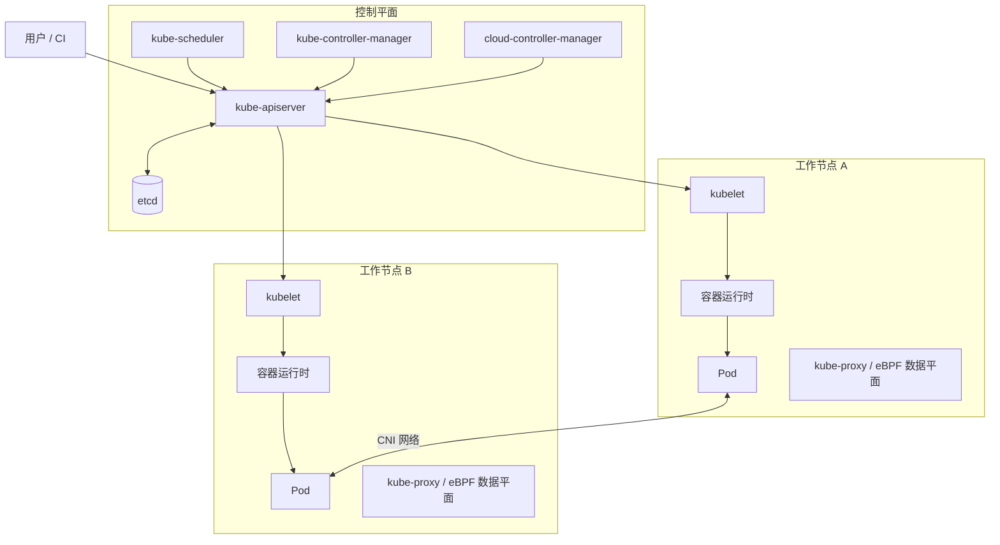

## 集群架构与组件

Kubernetes 集群由**控制平面（Control Plane）和一个或多个**工作节点（Worker Node）**组成。控制平面负责保存集群状态并作出调度决策，工作节点负责实际运行 Pod。



### 控制平面组件

| 组件 | 作用 |
| --- | --- |
| `kube-apiserver` | Kubernetes API 的统一入口，负责请求认证、鉴权、准入检查和资源数据读写。`kubectl`、控制器以及 `kubelet` 都通过它交互，而不是直接访问 `etcd`。 |
| `etcd` | 高可用键值数据库，保存集群配置和资源的期望状态，是控制平面的核心数据存储。生产环境应定期备份。 |
| `kube-scheduler` | 为尚未分配节点的 Pod 选择工作节点。选择时会考虑资源请求、污点与容忍、亲和性、拓扑约束等条件。 |
| `kube-controller-manager` | 运行 Deployment、ReplicaSet、Node、Job 等控制器，持续比较“期望状态”和“实际状态”并进行协调。 |
| `cloud-controller-manager` | 可选组件，用于连接云厂商 API，管理云负载均衡器、节点和路由等资源；裸金属集群通常不使用。 |

控制平面组件通常部署多个副本以实现高可用，多个 `kube-apiserver` 前面再放置一个负载均衡器；`etcd` 则通常以奇数成员组成集群。

### 工作节点组件

| 组件 | 作用 |
| --- | --- |
| `kubelet` | 节点代理，监听分配到本节点的 Pod，并调用容器运行时和存储、网络插件使 Pod 达到期望状态，同时上报节点与 Pod 状态。 |
| 容器运行时 | 通过 CRI（Container Runtime Interface）运行容器，常见实现有 `containerd` 和 CRI-O。Kubernetes 不直接负责运行容器。 |
| `kube-proxy` | 根据 Service 和 EndpointSlice 信息配置节点网络规则，实现 Service 流量转发。部分 CNI（如基于 eBPF 的实现）可以替代它的数据平面功能。 |
| CNI 插件 | 为 Pod 分配 IP，并实现同节点和跨节点的 Pod 网络。常见实现包括 Calico、Cilium、Flannel 等。 |

### 常用集群扩展

这些组件很常见，但并不都属于 Kubernetes 核心控制平面：

- **CoreDNS**：为 Service 和 Pod 提供集群内 DNS 解析。
- **Metrics Server**：提供基础 CPU、内存指标，供 `kubectl top` 和 HPA 使用；它不是完整的监控系统。
- **Ingress Controller / Gateway Controller**：读取 Ingress 或 Gateway API 资源，并真正配置反向代理或云负载均衡器。只创建 Ingress 资源而没有控制器不会产生入口流量。
- **CSI 驱动**：通过 Container Storage Interface 对接云盘、分布式存储等持久化存储。
- **CNI 插件**：实现 Pod 网络；NetworkPolicy 是否真正生效也取决于所选 CNI 是否支持。

## 集群网络与服务访问

Kubernetes 网络可以先记住四个基本原则：

1. 每个 Pod 拥有自己的集群内 IP；同一个 Pod 中的容器共享网络命名空间，可以通过 `localhost` 和彼此通信。
2. 在标准 Kubernetes 网络模型下，各节点上的 Pod 应能直接通过 Pod IP 通信，不需要应用自己做 NAT。
3. Pod 会被重建，Pod IP 并不稳定；长期访问一组 Pod 应使用 Service，而不是保存 Pod IP。
4. Service、Ingress 和 Gateway API 只是声明期望状态，实际转发依赖 `kube-proxy`、CNI、Ingress Controller、Gateway Controller 或云控制器等组件。

### 常见访问路径

| 访问场景 | 推荐方式 | 示例或说明 |
| --- | --- | --- |
| 同一 Pod 内的容器互访 | `localhost:<port>` | Sidecar 与主容器共享同一个 Pod IP 和端口空间。 |
| Pod 访问同一集群中的 Pod | 目标 Pod IP | 由 CNI 提供路由；仅适合调试或已知生命周期的场景。 |
| Pod 访问同命名空间的 Service | Service DNS 短名称 | `http://backend:8080` |
| Pod 跨命名空间访问 Service | 带命名空间的 DNS | `http://backend.production:8080` |
| 使用完整集群域名访问 Service | Service FQDN | `http://backend.production.svc.cluster.local:8080`，其中 `cluster.local` 可由集群自定义。 |
| 访问无头 Service | Headless Service | 设置 `clusterIP: None`，DNS 返回后端 Pod 地址，常用于 StatefulSet 和服务发现。 |
| 集群外访问单个服务 | `LoadBalancer` 或 `NodePort` | 云环境通常使用 `LoadBalancer`；`NodePort` 暴露为 `<任一节点IP>:<nodePort>`。 |
| 集群外访问多个 HTTP/HTTPS 服务 | Ingress 或 Gateway API | 根据域名、路径等规则，将流量转发到不同 Service；需要对应控制器。 |
| Pod 访问集群外服务 | 直接访问外部 DNS/IP | 通常经过节点 SNAT 或专用出口网关；具体行为由 CNI 和基础设施决定。 |

Service 的典型转发链路如下：

```text
客户端 Pod
  -> CoreDNS 将 backend.production.svc.cluster.local 解析为 Service ClusterIP
  -> kube-proxy 或 CNI 数据平面匹配 Service
  -> 从 EndpointSlice 中选择一个就绪 Pod
  -> 将流量转发到目标 Pod IP:targetPort
```

可以使用以下命令检查整个链路：

```shell
kubectl get svc backend -n production # 查看 Service、ClusterIP 和端口
kubectl get endpointslice -n production -l kubernetes.io/service-name=backend # 查看 Service 后端地址
kubectl get pods -n production -l app=backend -o wide # 查看后端 Pod、IP 和所在节点
kubectl exec -it <pod> -- nslookup backend.production # 在 Pod 内测试 DNS
kubectl exec -it <pod> -- curl http://backend.production:8080 # 在 Pod 内测试服务访问
```

### 从集群外访问集群内服务

常见入口链路为：

```text
用户
  -> 公网或内网负载均衡器
  -> Ingress Controller / Gateway
  -> Service
  -> Pod
```

- **`ClusterIP`**：默认类型，只能从集群网络内部访问。
- **`NodePort`**：在每个节点上开放固定端口，适合基础接入或调试；生产环境通常在它前面再放负载均衡器。
- **`LoadBalancer`**：请求云控制器或负载均衡器实现分配外部地址；裸金属环境需要 MetalLB 等实现。
- **Ingress**：主要处理 HTTP/HTTPS 七层路由，必须安装 Ingress Controller。
- **Gateway API**：比 Ingress 角色划分更清晰、扩展能力更强，也需要安装支持它的 Gateway Controller。

`kubectl port-forward` 适合本地临时调试，不应作为生产服务入口。

### 两个 Kubernetes 集群之间互访

Kubernetes 核心 API 不会自动打通两个独立集群的 Pod 网络、Service DNS 和身份体系。跨集群访问通常选择以下方式之一：

1. **通过服务入口访问（最简单）**
   - 集群 A 将服务暴露为内网 `LoadBalancer`、Ingress 或 Gateway。
   - 集群 B 通过该内网地址或企业 DNS 访问。
   - 两个集群无需共享 Pod 网段，故障边界也较清晰，通常是优先方案。

2. **打通 Pod 网络**
   - 使用 VPC Peering、VPN、专线或支持多集群的 CNI，使双方 Pod CIDR 可以互相路由。
   - 两个集群的 Pod CIDR、Service CIDR 和节点网段不能冲突。
   - 还需要单独处理 DNS 服务发现、防火墙、NetworkPolicy 和流量加密；网络可达不等于服务可以被名称发现。

3. **多集群服务发现或服务网格**
   - 使用 Multi-Cluster Services API、Cilium Cluster Mesh、Istio 等方案同步服务信息或建立跨集群数据平面。
   - 适合跨集群服务发现、流量治理、双向 TLS、故障转移等需求，但运维复杂度高于通过普通服务入口访问。

跨集群设计时至少确认以下事项：

- Pod CIDR、Service CIDR 和节点网段是否重叠。
- 服务名称如何解析，以及 DNS 故障时如何处理。
- 流量是否需要双向访问，还是只允许单向调用。
- NetworkPolicy、云安全组和防火墙是否同时放行。
- 身份认证、TLS、证书轮换及 Secret 是否跨集群同步。
- 服务发现和故障转移是手动、DNS 级还是由多集群控制面完成。

### NetworkPolicy

默认情况下，许多 Kubernetes 集群允许 Pod 之间自由通信。可以使用 NetworkPolicy 将访问范围限制为“默认拒绝，再按需放行”。NetworkPolicy 是命名空间级资源，而且只有支持它的 CNI 才会执行规则。

下面的规则只允许同一命名空间中带有 `app: frontend` 标签的 Pod 访问 `app: backend` Pod 的 TCP 8080 端口：

```yaml
apiVersion: networking.k8s.io/v1
kind: NetworkPolicy
metadata:
  name: allow-frontend-to-backend
  namespace: production
spec:
  podSelector:
    matchLabels:
      app: backend
  policyTypes:
    - Ingress
  ingress:
    - from:
        - podSelector:
            matchLabels:
              app: frontend
      ports:
        - protocol: TCP
          port: 8080
```

> `podSelector` 单独使用时只匹配当前 NetworkPolicy 所在命名空间。如果要允许其他命名空间，应结合 `namespaceSelector`，并根据需要再嵌套 `podSelector`。

## kubectl

### 基本信息

```shell
kubectl --help			# 查看帮助
kubectl api-versions	# 查看 API 版本
kubectl cluster-info	# 查看集群信息
```

### 查看信息

```shell
kubectl get nodes	# 查看集群节点信息
kubectl get pods	# 简写 po 查看 Pod 信息
kubectl get svc		# 查看 Service
kubectl get deploy	# 查看 Deploy
kubectl get rs		# 查看 ReplicaSet
kubectl get cm		# 查看 ConfigMap
kubectl get secret	# 查看 Secret
kubectl get ing		# 查看 Ingress
kubectl get pv		# 查看 PersistentVolume
kubectl get pvc		# 查看 PersistentVolumeClaim
kubectl get ns		# 查看 Namespace
kubectl get node	# 查看 Node
kubectl get all		# 查看所有资源
kubectl get pods -o wide	# 查看详细信息
kubectl get pod nginx		# kubectl describe RESOURCE NAME 查看某类型资源信息
```

### 运行创建

```shell
kubectl run nginx --image=nginx	# 创建并运行一个名字为nginx的Pod

kubectl create deployment nginx-deploy --image=nginx # 创建 Nginx 的 Doployment资源

kubectl create -f nginx.yaml # 根据nginx.yaml配置文件创建资源

kubectl create -f https://k8s.io/examples/application/deployment.yaml # 根据URL创建资源

kubectl create -f ./dir # 根据目录下的所有配置文件创建资源

kubectl apply -f (-k DIRECTORY | -f FILENAME | stdin) # 通过文件名或标准输入配置资源

kubectl apply -n default -f nginx.yaml # 根据 nginx.yaml 配置文件在命名空间 default 创建资源
```

### 调试交互

```shell
kubectl logs nginx-pod # 查看名为 nginx-pod 的 Pod 日志

kubectl port-forward nginx-pod 8080:80 # 将名为 nginx-pod 的 Pod 的80端口转发到本地

kubectl attach POD -c CONTAINER # 连接到现有的某个 Pod（将某个Pod的标准输入输出转发到本地）

kubectl run nginx --image=nginx -- /bin/bash # 运行名字为 nginx 的 Pod 容器启动时执行 bash 而不是默认 nginx 服务
```

### 滚动发布与回滚

```shell
kubectl rollout status deployment/nginx # 等待并查看 Deployment 滚动发布状态
kubectl rollout history deployment/nginx # 查看 Deployment 的发布历史
kubectl rollout history deployment/nginx --revision=2 # 查看指定版本的详情
kubectl rollout undo deployment/nginx # 回滚到上一版本
kubectl rollout undo deployment/nginx --to-revision=2 # 回滚到指定版本
kubectl rollout restart deployment/nginx # 重启 Deployment 管理的所有 Pod
kubectl rollout pause deployment/nginx # 暂停滚动发布，便于连续修改配置
kubectl rollout resume deployment/nginx # 恢复已暂停的滚动发布
```

> 对非 `default` 命名空间的资源，在命令末尾加上 `-n <namespace>`，例如：`kubectl rollout status deployment/nginx -n production`。

### 修改删除清理

```shell
kubectl label pod nginx app=test pr=xxx # 更新名字为nginx的Pod的标签

kubectl delete pod nginx # 删除名字为nginx的Pod

kubectl delete pod --all # 删除 Pod 的所有实例

kubectl delete -f FILENAME # 根据YAML配置文件删除资源

kubectl scale --replicas=3 deployment/nginx # 设置名为 nginx 的 Deployment 的副本数

kubectl replace -f nginx.yaml # 根据nginx.yaml配置文件替换名字为nginx的Deployment

kubectl edit deploy nginx-test # 修改名为 nginx-test 的 Deployment 配置
```

## 部署配置文件

### Pod

```yaml
apiVersion: v1  # 指定API版本，Pod使用v1
kind: Pod  # 资源类型为Pod，直接创建单个Pod实例（注意：生产中通常使用Deployment管理Pod）
metadata:  # 元数据部分，描述Pod的基本信息
  name: example-pod  # Pod的唯一名称，必须在命名空间内唯一
  namespace: default  # Pod所属的命名空间，默认是default；用于逻辑隔离资源
  labels:  # 标签键值对，用于Pod的选择、分组和过滤（例如kubectl label或selector使用）
    app: example-app  # 自定义标签，表示应用名称
    version: v1.0  # 版本标签，便于版本管理
  annotations:  # 注解键值对，不用于选择，但可存储元数据（如描述、配置或工具信息）
    description: "This is an example pod with comprehensive options"  # 示例描述注解

spec:  # Pod规范，定义Pod的运行细节
  # 容器列表：Pod至少需要一个容器（主容器），可定义多个容器共享网络和存储
  containers:
  - name: main-container  # 容器的名称，在Pod内唯一
    image: nginx:1.21  # 容器镜像的完整名称和标签（registry/image:tag）；如果未指定registry，默认使用Docker Hub
    imagePullPolicy: IfNotPresent  # 镜像拉取策略：Always（总是拉取）、IfNotPresent（本地不存在时拉取）、Never（仅使用本地镜像）
    command: ["/bin/sh", "-c"]  # 覆盖Dockerfile中的默认ENTRYPOINT，指定启动命令（数组形式）
    args: ["echo 'Hello, Kubernetes!' && sleep 3600"]  # 传递给command的参数；这里模拟一个简单任务后休眠
    ports:  # 定义容器暴露的端口列表，用于服务发现和网络配置
    - containerPort: 80  # 容器内部监听的端口号
      protocol: TCP  # 协议类型：TCP（默认）或UDP
      name: http  # 端口名称，用于引用（例如在Service中）
    env:  # 环境变量列表，注入到容器进程中
    - name: ENV_VAR1  # 变量名
      value: "value1"  # 变量值（静态）
    - name: ENV_VAR2
      valueFrom:  # 从Kubernetes资源动态获取值
        secretKeyRef:  # 从Secret资源获取（例如敏感数据如密码）
          name: my-secret  # Secret的名称
          key: password  # Secret中的键
    envFrom:  # 批量导入环境变量，从ConfigMap或Secret
    - configMapRef:  # 从ConfigMap导入所有键值对作为环境变量
        name: my-configmap  # ConfigMap的名称
    resources:  # 资源请求和限制，影响调度和资源分配
      requests:  # 保证Pod至少获得这些资源；调度时使用
        cpu: "100m"  # CPU请求（m表示毫核，100m=0.1核）
        memory: "128Mi"  # 内存请求（Mi表示兆字节）
      limits:  # Pod不能超过这些资源；运行时强制执行
        cpu: "500m"  # CPU限制
        memory: "256Mi"  # 内存限制（超过可能导致OOM）
    volumeMounts:  # 卷挂载列表，将卷挂载到容器文件系统
    - name: config-volume  # 对应volumes中的卷名
      mountPath: /etc/config  # 挂载路径（容器内的绝对路径）
      readOnly: true  # 是否只读挂载（true表示容器不能写入）
    - name: data-volume
      mountPath: /data  # 另一个挂载路径
    livenessProbe:  # 存活探针：检测容器是否正常运行；失败时重启容器
      httpGet:  # HTTP方式探针，向指定路径发送GET请求
        path: /health  # 请求路径
        port: 80  # 端口（可使用端口名或数字）
      initialDelaySeconds: 30  # 容器启动后延迟多久开始探测
      periodSeconds: 10  # 探测间隔时间
    readinessProbe:  # 就绪探针：检测容器是否准备好接收流量；失败时从Service中移除
      exec:  # 执行命令方式探针，在容器内运行命令
        command: ["cat", "/tmp/ready"]  # 命令数组；成功（退出码0）表示就绪
      initialDelaySeconds: 5  # 初始延迟
      periodSeconds: 5  # 间隔
    startupProbe:  # 启动探针：检测容器是否已成功启动；用于慢启动应用，禁用其他探针直到成功
      tcpSocket:  # TCP套接字方式，检查端口是否可连接
        port: 80
      initialDelaySeconds: 10  # 初始延迟
      periodSeconds: 5  # 间隔
      failureThreshold: 30  # 连续失败次数阈值
    lifecycle:  # 生命周期钩子：在容器特定阶段执行操作
      postStart:  # 容器启动后立即执行（异步，不阻塞容器启动）
        exec:
          command: ["echo", "Container started"]  # 示例：打印日志
      preStop:  # 容器停止前执行（阻塞停止过程，给时间清理）
        exec:
          command: ["echo", "Container stopping"]
    securityContext:  # 容器级安全上下文，控制容器运行时的安全设置
      runAsUser: 1000  # 以指定用户ID运行容器进程（非root）
      runAsGroup: 1000  # 以指定组ID运行
      privileged: false  # 是否运行在特权模式（允许访问主机设备，危险）
      allowPrivilegeEscalation: false  # 是否允许进程提升权限
      readOnlyRootFilesystem: true  # 将根文件系统挂载为只读（提高安全性）
      capabilities:  # Linux内核能力，精细控制权限
        add: ["NET_ADMIN"]  # 添加能力（如网络管理）
        drop: ["ALL"]  # 移除所有默认能力（最小权限原则）
    # 可在此添加更多容器（sidecar模式）

  # 初始化容器：在主容器启动前顺序运行，用于准备工作（如数据初始化）
  initContainers:
  - name: init-container  # 初始化容器名称
    image: busybox:1.35  # 轻量镜像
    command: ["sh", "-c", "echo 'Initializing...' && sleep 5"]  # 示例初始化任务

  # 卷定义：声明Pod可用的存储卷，由容器挂载使用
  volumes:
  - name: config-volume  # ConfigMap类型的卷，将ConfigMap数据作为文件挂载
    configMap:
      name: my-configmap
  - name: data-volume  # emptyDir类型的卷，临时目录，Pod删除时丢失
    emptyDir: {}
  - name: secret-volume  # Secret类型的卷，挂载敏感数据
    secret:
      secretName: my-secret
  - name: host-volume  # hostPath类型的卷，直接挂载主机路径（危险，仅用于特定场景）
    hostPath:
      path: /host/path  # 主机上的绝对路径
      type: Directory  # 类型：Directory（目录）、File等

  # 重启策略：定义Pod失败时的重启行为
  restartPolicy: Always  # Always（总是重启）、OnFailure（仅失败时重启）、Never（不重启）

  # 节点选择器：强制将Pod调度到具有特定标签的节点
  nodeSelector:
    kubernetes.io/os: linux  # 仅调度到Linux节点

  # 亲和性和反亲和性：高级调度规则，影响Pod放置
  affinity:
    nodeAffinity:  # 节点亲和性：Pod倾向或必须调度到特定节点
      requiredDuringSchedulingIgnoredDuringExecution:  # 硬亲和性（必须满足，否则不调度）
        nodeSelectorTerms:
        - matchExpressions:
          - key: kubernetes.io/os  # 节点标签键
            operator: In  # 操作符：In、NotIn、Exists等
            values:
            - linux  # 匹配值
    podAffinity:  # Pod亲和性：Pod倾向调度到有其他Pod的节点附近
      requiredDuringSchedulingIgnoredDuringExecution:
      - labelSelector:  # 选择器匹配其他Pod的标签
          matchLabels:
            app: example-app
        topologyKey: kubernetes.io/hostname  # 拓扑域（例如节点）
    podAntiAffinity:  # Pod反亲和性：避免Pod调度到同一位置，提高可用性
      preferredDuringSchedulingIgnoredDuringExecution:  # 软反亲和性（倾向但不强制）
      - weight: 100  # 权重（1-100），影响调度优先级
        podAffinityTerm:
          labelSelector:
            matchLabels:
              app: example-app
          topologyKey: kubernetes.io/hostname

  # 容忍度：允许Pod调度到有污点的节点（tolerations匹配taints）
  tolerations:
  - key: "node-type"  # 污点键
    operator: "Equal"  # 操作符：Equal或Exists
    value: "spot"  # 匹配值
    effect: "NoSchedule"  # 效果：NoSchedule、PreferNoSchedule、NoExecute

  # Pod级安全上下文：应用于所有容器的全局安全设置
  securityContext:
    runAsUser: 1000  # 默认用户ID
    runAsGroup: 1000  # 默认组ID
    fsGroup: 1000  # 文件系统组ID（影响卷权限）

  # 服务账户：用于Pod访问Kubernetes API（RBAC权限）
  serviceAccountName: default  # 默认服务账户，或自定义

  # DNS配置：控制Pod的DNS解析行为
  dnsPolicy: ClusterFirst  # DNS策略：ClusterFirst（优先集群DNS）、Default等
  dnsConfig:  # 自定义DNS设置
    nameservers:  # 自定义DNS服务器
    - 8.8.8.8  # Google DNS
    options:  # DNS选项
    - name: ndots  # 选项名
      value: "2"  # 值

  # 主机共享设置：是否共享主机资源（通常设为false以隔离）
  hostNetwork: false  # 共享主机网络命名空间（true时Pod使用主机IP）
  hostPID: false  # 共享主机PID命名空间
  hostIPC: false  # 共享主机IPC命名空间

  # 调度器名称：指定使用哪个调度器（默认default-scheduler）
  schedulerName: default-scheduler

  # 优先级类：影响调度和抢占（需要预定义PriorityClass）
  priorityClassName: high-priority  # 高优先级类名

  # 其他高级选项（如runtimeClassName用于指定运行时、overhead用于资源开销）可根据需要添加
```


### ConfigMap

```yaml
kind: ConfigMap # 定义资源类型为ConfigMap
apiVersion: v1 # 指定Kubernetes API版本为v1
metadata:
  name: configmap-nginx-deploy
  namespace: default
data: # 配置数据
  DB_HOST: "7891" # key:value
```

### Deployment

```yaml
apiVersion: apps/v1 # 指定Kubernetes API版本为apps/v1
kind: Deployment # 定义资源类型为Deployment部署
metadata: # 元数据部分，包含资源的基本信息
  name: nginx-deploy # 部署的名称
  namespace: default # 部署所在的命名空间
  labels: # 标签，用于标识和选择资源
    app: nginx-deploy # 应用标签，值为nginx-deploy
spec: # 部署的详细规格配置
  selector: # 选择器，用于匹配要管理的Pod
    matchLabels: # 匹配标签的方式
      app: nginx-deploy # 匹配带有此标签的Pod
  replicas: 1 # 指定Pod副本数量为1个
  strategy: # 部署更新策略
    rollingUpdate: # 滚动更新配置
      maxSurge: 25% # 更新时最多可以超出期望副本数的25%
      maxUnavailable: 25% # 更新时最多可以有25%的Pod不可用
    type: RollingUpdate # 更新类型为滚动更新
  template: # Pod模板，定义要创建的Pod
    metadata: # Pod的元数据
      labels: # Pod的标签
        app: nginx-deploy # Pod标签，与selector匹配
    spec: # Pod的具体规格
      # initContainers:  # 初始化容器配置（已注释）
      # Init containers are exactly like regular containers, except:  # 初始化容器说明
      # - Init containers always run to completion.  # 初始化容器总是运行到完成
      # - Each init container must complete successfully before the next one starts.  # 每个初始化容器必须成功完成后才能启动下一个
      containers: # 容器列表
        - name: nginx-deploy # 容器名称
          image: nginx:latest # 容器镜像及标签
          resources: # 资源限制和请求
            requests: # 资源请求，容器启动时保证的资源
              cpu: 100m # CPU请求100毫核
              memory: 100Mi # 内存请求100MB
            limits: # 资源限制，容器能使用的最大资源
              cpu: 100m # CPU限制100毫核
              memory: 100Mi # 内存限制100MB
          livenessProbe: # 存活探针，检查容器是否还在运行
            tcpSocket: # 使用TCP套接字检查
              port: 80 # 检查80端口
            initialDelaySeconds: 5 # 容器启动后5秒开始检查
            timeoutSeconds: 5 # 每次检查超时时间5秒
            successThreshold: 1 # 成功1次认为探针成功
            failureThreshold: 3 # 失败3次认为探针失败
            periodSeconds: 10 # 每10秒检查一次
          readinessProbe: # 就绪探针，检查容器是否准备好接收流量
            httpGet: # 使用HTTP GET请求检查
              path: / # 健康检查路径
              port: 80 # 检查80端口
            initialDelaySeconds: 5 # 容器启动后5秒开始检查
            timeoutSeconds: 2 # 每次检查超时时间2秒
            successThreshold: 1 # 成功1次认为探针成功
            failureThreshold: 3 # 失败3次认为探针失败
            periodSeconds: 10 # 每10秒检查一次
          env: # 环境变量列表
            - name: DB_HOST # 环境变量名称
              valueFrom: # 从其他资源获取值
                configMapKeyRef: # 从ConfigMap获取
                  name: nginx-deploy # ConfigMap名称
                  key: DB_HOST # ConfigMap中的键名
          ports: # 容器端口配置
            - containerPort: 80 # 容器内部端口80
              name: nginx-deploy # 端口名称
          volumeMounts: # 卷挂载配置
            - name: localtime # 挂载的卷名称
              mountPath: /etc/localtime # 容器内挂载路径
      volumes: # 卷定义
        - name: localtime # 卷名称
          hostPath: # 主机路径类型的卷
            path: /usr/share/zoneinfo/Asia/Shanghai # 主机上的路径，用于设置时区
      restartPolicy: Always # 重启策略，总是重启失败的容器

```

### Service

```yaml
apiVersion: v1 # 指定Kubernetes API版本为v1
kind: Service # 定义资源类型为Service
metadata:
  name: nginx-deploy
  namespace: default
spec:
  selector:
    app: nginx-deploy
  type: NodePort # 服务类型默认为 ClusterIP 内部服务
  sessionAffinity: None
  sessionAffinityConfig: # 会话亲和性配置
    clientIP: # 客户端IP
      timeoutSeconds: 10800 # 超时时间为10800秒
  ports: # 端口配置
  - name: nginx-deploy # 端口名称
    protocol: TCP # 使用TCP协议
    port: 80 # 服务端口
    targetPort: 80 # 容器端口
    # If you set the `spec.type` field to `NodePort` and you want a specific port number,
    # you can specify a value in the `spec.ports[*].nodePort` field.
    nodePort: 30080 # NodePort 每个节点的指定端口进行访问，范围需要在 30000-32767 之间
```

